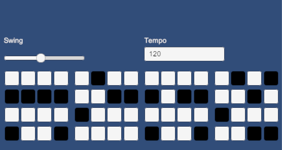

# RhythmSystem

Basic notification-based rhythm system for Unity.

Add the RhythmSystem component to a GameObject and subscribe from other scripts:

```C#
public class Test : MonoBehaviour 
{
    private void Start()
    {
        RhythmTracker.instance.SetTempo(140);
        RhythmTracker.instance.Subscribe(Trigger, RhythmTracker.TriggerTiming.Eighths);
    }

    // This will run on every eighth note at 140bpm;
    private void Trigger(int beatIndex)
    {
        GetComponent<AudioSource>().Play();
        print("Beat Index: " + beatIndex.ToString());
    }
}
```

You can also set an offset, to get advance notifications of beats, in addition to the beats themselves.

Note: While the RhythmTracker notifications are quite accurate, triggering clips with `AudioSource.Play()` or `AudioSource.PlayOneShot()` (as in the step sequencer demo scene) sounds pretty loose. I believe this is because there's an unpredictable delay between calling them and actually hearing the result. I plan to experiment with building a helper utility that features a buffer and uses `AudioSource.PlayScheduled()` to work aronud this issue. 

## Adaptive Music

Additionally, there's an Adaptive Music behavior with a demo. This component provides an "adaptive music" bed in its absolute simplest form (simple to the point that "adaptive music" may be a misnomer). It crossfades smoothly between any number of audio loops, in series, mapped to a single normalized float. So, you can create 5 variations of background music, for example. The first being calm and subdued, the second being a bit more aggressive, and so on... increasing in intensity. Then map health percentage, or proximity-to-boss to `AdaptiveMusic.SetIntensity(float intensity)`. As the value increases from 0 to 1, the music gradually morphs between each variation. 

Lots of plans to expand on this. In particular, I will extend RhythmTracker to allow an `AdaptiveMusic` component as a `PlaybackAudioSource`. I'd also like to introduce a way to queue tempo synced changes between adaptive loop sets representing different themes.

  


